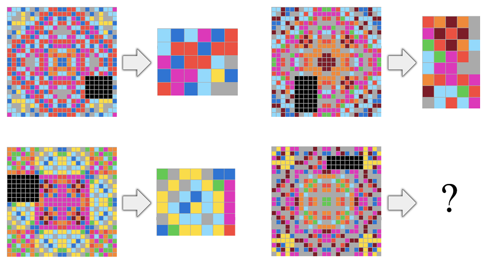

## 서지 정보

- 제목: On the Measure of Intelligence
- 저자: Francois Chollet
- 기관: Google
- 발표 / 출판: arXiv
- 출판 연도: 2019
- 링크 / 코드·데이터:
  - 논문: https://arxiv.org/abs/1911.01547
  - 공식 사이트: https://arcprize.org/arc-agi/1
  - github: https://github.com/fchollet/ARC-AGI

---

## 세 줄 요약

- 지능은 특정한 문제를 해결하는 기술이 아니라 사전지식과 경험을 일반화함을 통해 주어진 문제를 해결하기 위한 새로운 기술을 효율적으로 습득하는 능력이다.
  - $\text{Intelligence} \neq \text{Skill}$
  - $\text{Intelligence} \approx \frac{\text{Skill} \times \text{Generalization Difficulty}}{\text{Priors} + \text{Experience}}$
- ARC는 이 원칙을 준수하는 벤치마크로 처음 보는 과제를 몇 개의 예시만으로 추론해 해결하는 능력을 측정한다.

---

## 요약

### 1. 배경

#### 지능을 엄밀하게 측정하는 방법의 필요성

- 인간지능과 같은 인공지능을 만드려는 시도는 계속되어 왔으나, 정작 AI 연구자들은 지능을 제대로 측정하지 못하고 있다. 인공지능의 발전을 보조하고 그 수준을 수치화하기 위해 우리는 인공지능에서 인간 같은 '일반지능'을 측정할 수 있어야 한다.
- 그러나 현재는 마땅한 방법이 없고, 연구자들의 관심도 부족하다. 일례로, 연구자들은 AI가 인간을 특정한 과제 (e.g., 비디오 게임) 에서 이기는 것을 지능의 증거로 삼고는 한다. 이는 지능과 지능의 파생물인 기술을 혼동하는 것이다.
- 나는 발달인지심리학으로부터 얻은 통찰을 바탕으로 인공 지능 측정의 현대적 관점을 제공하고자 한다.

#### 지능의 두 가지 요소

- 지능의 정의는 너무나 많고 합의된 적도 없지만 가장 유명한 정의는 이것이다. *"지능은 행위자가 광범위한 환경에서 목표를 달성하는 능력을 측정한다."* (Legg & Hutter, 2007) 이 표현을 아래와 같이 분해해 보자.
  - "목표를 달성" -> 기술이 있다
  - "광범위한 환경" -> 일반화 능력이 있다
- 튜링도 인공지능의 미래에 관하여 비슷한 말을 했다. *"만약 우리가 언젠가 인간의 언어를 말하고, 이해하고, 번역하며, 상상력을 발휘해 수학 문제를 풀고, 전문적인 직업을 수행하거나 조직을 이끄는 기계를 만들고자 한다면, 두 가지 길 중 하나를 택해야 한다. 이러한 활동들을 너무나 정밀한 과학으로 환원해서 기계에게 그것들을 어떻게 수행해야 하는지 정확히 지시할 수 있게 하거나 , 아니면 정확히 어떻게 해야 하는지를 일일이 지시받지 않고도 스스로 일을 해낼 수 있는 기계를 개발해야 한다"*
- 결론적으로, 지능은 단순히 기술이 많은 것을 의미하지 않고 오히려 새로운 기술을 습득할 수 있는 능력이 핵심적이다.

#### 지금까지의 AI 평가

* 주어진 문제를 얼마나 잘 푸는가, 즉 기술을 평가하려는 노력은 꽤나 성공해왔다. 아래는 지금까지 성공한 방식들.
  * 인간 평가: 인간이 결과물 평가
  * 화이트 박스 분석: 모든 가능한 경우의 수에 대한 분석
  * 동료 비교: 동일한 기능의 AI와경쟁 (e.g., 체스 기계끼리 경쟁)
  * 벤치마크: 테스트셋을 마련하여 반복적으로 이용
* 그러나 우리는 기술 평가는 진정한 능력 평가가 아님을 알게 되었다. 예를 들어, 연구자들은 체스에서 인간의 고등 인지 기능이 사용되므로 체스 기계를 만들면 인간 수준의 지능을 달성할 수 있다고 믿었다. 그러나 체스 기계는 체스만 잘 둘 뿐 다른 어떤 능력도 발현하지 못했다.
* 다시 말해, 우리는 일반화에서 뛰어난 (i.e., 기술이 좋은 것이 아니라 기술 습득 능력이 좋은) AI를 만들어야 하며, 이를 위해서 일반화 능력 측면에서 AI를 평가해야 한다.
* 이러한 평가를 위해 심리측정학을 이용할 필요가 있다. 심리측정학은 심리학의 한 갈래로 인간의 지능을 측정하는 타당한 기법들을 제시해왔다. 그리고 이 기법들은 AI 평가에 아래와 같은 여러 영감을 준다.
  * 심리측정학은 기술이 아닌 기술을 습득하게 한 근원적인 능력을 측정한다.
  * 심리측정학은 근원적 능력을 추정하기 위해 지능을 여러 능력으로 분해하여 측정한다.
  * 심리측정학의 강한 통계적 건전성이 AI 평가 방법론에 모범이 될 수 있다.
* 하지만 AI 평가에 심리측정학을 전용하기 위해서는 약간의 변형이 필요하다. 왜냐하면 인간 능력과 AI 능력은 다르기 때문이다. 예컨대, '새로운 기술을 학습'하는 것은 인간에게는 상대적으로 쉽지만 AI에게는 아주 어려울 수 있다.

### 2. 새로운 관점

#### 비판적 평가

* 만약 어떤 프로그램이 개발자의 의도대로 문제를 잘 풀어냈다면, 문제를 푼 주체는 프로그램이 아니라 개발자다. 즉, 기술을 습득할 능력이 없는 소프트웨어는 지능적이지 않다고 봐야 한다.
* 이런 관점에서 딥 러닝은 지능적이지 않을 수도 있다. 개발자가 의도적으로 마련한 학습 데이터 이상의 능력을 갖기는 어렵기 때문. 반면, 인간 지능은 진화의 과정에서 얻은 능력을 꽤 잘 일반화하는 편이다. 예컨대, 인간은 피아노 연주를 하도록 진화하지 않았으나 피아노 연주를 할 수 있다.
* 그래서 우리는 인간의 이러한 일반화 능력을 지능의 핵심으로 보고 AI 평가에 적용한다. 인간이 우주 최고의 지능이라서가 아니라, 이미 잘 정의된 인간 능력 평가를 활용하는 것이 현재로서 최선의 방식이기 때문이다.
* 그런데 인간의 학습 능력은 빈 칠판에서 시작하지 않는다. 오히려 최소한의 사전 지식 혹은 사전 능력을 토대로 새로운 것을 배운다. 발달심리학은 아래의 능력들이 인간의 기본적인 사전 능력이라고 본다.
  * 물질성과 기초적인 물리 감각: 세상이 물질로 이루어져 있고 그 물질들에 기초적인 법칙이 있다는 사실 (e.g., 물체에는 중력이 작용한다).
  * 기초적인 수 감각: 더하기 빼기 등 기초적인 산수에 대한 이해.
  * 기초적인 기하 감각: 방향, 거리, 연결 등에 관한 기초적인 직관.
  * 목적지향성: 물체가 움직인다면 그것을 움직이게 한 원인이 있다는 것을 이해. 또한 움직이는 물체에 의도가 담겨져 있으리라 짐작.
* AI 평가에서도 이 정도의 능력은 사전에 학습되는 것을 허용한다. 단, 이보다 많은 능력이 학습되어 있으면 불공정하다고 본다.

#### 지능의 정식화

* 지금까지의 논의를 종합하면 지능은 다음과 같이 정의할 수 있다. **지능은 일정한 과제 범위(scope)에서, 사전지식(priors)과 경험(experience)을 이용해 새로운 기술(skill)을 획득하는 능력이다.**
* 여기서 기술과 지능을 명시적으로 구분해야 한다.
  * Skill: 특정 과제를 얼마나 잘 수행하는가.
  * Intelligence: 그 skill을 얼마나 효율적으로 획득했는가.
* 따라서 높은 skill이 곧 높은 intelligence를 뜻하지 않는다. 많은 사전지식을 하드코딩하거나 엄청난 양의 학습 데이터를 사용하면 낮은 일반화 능력으로도 높은 skill을 얻을 수 있기 때문이다.
* 논문은 이를 표현하기 위해 'intelligent system'과 'skill program'을 구분한다.
  * Intelligent system: 경험을 받아 새로운 task를 학습하고 그 task를 수행할 수 있는 프로그램을 만들어내는 시스템.
  * Skill program: 학습 결과로 만들어진 특정 task 수행 능력.
  * ** 예컨대 체스 규칙을 새롭게 학습할 수 있는 시스템이 intelligent system이라면, 그 결과 만들어진 체스 플레이어는 skill program에 해당한다.
* 학습 과정에서 시스템이 겪는 경험의 순서를 curriculum이라고 한다. Curriculum은 단순한 데이터셋이 아니라 situation, response, feedback의 연속이며, 어떤 경험이 어떤 순서로 주어지는지도 학습 효율에 영향을 준다.
* 시스템이 어떤 task에서 도달할 수 있는 최고 skill을 그 task에 대한 potential이라고 한다 (e.g., 최단 거리). 또한 시스템이 충분한 skill을 얻을 수 있는 task들의 범위를 scope라고 한다.
* 따라서 지능은 절대적인 하나의 값이 아니라 특정한 scope에 대해서만 정의될 수 있다.

#### 일반화 난이도, 사전지식, 경험

* 지능을 측정하려면 단순히 최종 skill만 보아서는 안 되고, 다음 세 요소를 함께 고려해야 한다.
  * Generalization difficulty: 학습 중 본 사례로부터 평가 상황까지 일반화하는 것이 얼마나 어려운가.
  * Priors: 학습을 시작하기 전에 이미 solution과 관련하여 얼마나 많은 정보를 가지고 있었는가.
  * Experience: 학습 과정에서 solution에 관한 새로운 정보를 얼마나 획득했는가.
* 논문은 이 세 요소를 Algorithmic Information Theory, 특히 Kolmogorov complexity를 이용해 정식화한다.
* Generalization difficulty는 대략적으로, training 사례들만 잘 처리하는 가장 단순한 프로그램에서 실제 evaluation까지 잘 처리하는 프로그램으로 가기 위해 얼마나 많은 추가 정보가 필요한지를 뜻한다.
* Priors는 최종 solution에 필요한 정보 가운데 시스템이 학습 시작 전에 이미 가지고 있던 정보의 양이다.
* Experience는 학습 과정에서 받은 정보가 최종 solution에 대한 불확실성을 얼마나 줄였는지를 나타낸다.
* 따라서 논문의 지능 정의는 개념적으로 다음과 같이 표현할 수 있다. *(작성자 주. 정확한 공식은 여러 task와 여러 curriculum에 대한 기대값과 task별 가치 등등 포함하지만, 핵심적인 의미는 대강 이 식과 같다. 또한 원래의 공식은 계산 불가능한 것으로 보인다. 따라서 이 수학적 정의는 실제 점수를 직접 계산하기 위한 공식이라기보다, 지능 평가가 통제해야 하는 요소를 명확하게 하기 위한 이론적 틀로 생각하면 될 듯.)*

$$
\text{Intelligence}
\approx
\frac{
\text{Skill} \times \text{Generalization Difficulty}
}{
\text{Priors} + \text{Experience}
}
$$

* 즉, 높은 난이도의 새로운 task에서 높은 skill을 얻되, 적은 사전지식과 적은 경험만을 사용했다면 높은 지능을 보인 것으로 간주한다.

#### 공정한 지능 비교

* 서로 다른 두 시스템의 지능을 비교하려면 몇 가지 조건이 필요하다.
  * 두 시스템이 평가받는 task의 scope가 같아야 한다.
  * 비교하려는 skill의 기준도 같아야 한다. 한 시스템의 최고 성능과 다른 시스템의 낮은 성능을 비교하는 것은 지능 비교가 아니다.
  * 두 시스템의 knowledge priors도 가능한 한 비슷해야 한다.
* 이 조건들이 만족된다면 더 적은 experience를 사용해 같은 수준의 skill에 도달한 시스템을 더 지능적이라고 볼 수 있다.
* 따라서 인간과 AI를 비교할 때도 AI의 최대 성능이 인간보다 높은지를 보는 것이 아니라, 인간과 같은 종류의 task에서 같은 수준의 skill을 얻는 데 얼마나 적은 경험이 필요한지를 비교해야 한다.
* 이 관점에서 수백만 번의 self-play를 거쳐 인간 챔피언을 이긴 AI는 높은 skill을 보인 것은 맞지만, 그 사실만으로 인간보다 높은 intelligence를 보였다고 말할 수는 없다.

#### 이상적인 지능 벤치마크

* 이상의 논의에 따라 인간과 유사한 일반지능을 평가하는 벤치마크는 다음 조건을 만족해야 한다.
  * 무엇을 측정하는지 명확하고, 실제 능력과의 관계가 검증되어야 한다(validity).
  * 반복해서 평가해도 비슷한 결과가 나와야 한다(reliability).
  * 특정 skill이 아니라 broad ability를 평가해야 한다.
  * 평가 task는 시스템뿐 아니라 시스템 개발자에게도 사전에 알려져 있지 않아야 한다.
  * 학습에 사용할 수 있는 experience의 양을 제한해야 한다. 무한한 데이터를 생성해 성능을 살 수 있어서는 안 된다.
  * benchmark가 가정하는 priors를 명시적으로 기술해야 한다.
  * 인간과 AI를 비교한다면 양쪽 모두에게 공정한 priors와 experience 조건을 사용해야 한다.
* 특히 개발자까지 평가 task를 미리 모르는 것이 중요하다. 모델이 test example을 직접 보지 않았더라도 개발자가 task 구조를 알고 시스템을 그 task에 맞게 설계했다면 진정한 의미의 broad generalization을 평가했다고 보기 어렵기 때문이다. 이를 developer-aware generalization이라고 한다.

### 3. ARC: 일반지능 벤치마크의 제안

#### ARC의 기본 구조

* Chollet은 위의 원칙을 실제 평가에 적용하기 위해 Abstraction and Reasoning Corpus(ARC)를 제안한다.
* ARC는 인간과 AI 모두가 풀 수 있도록 설계된 일종의 추상 추론 문제 모음이다.
* 각 문제(task)는 1×1에서 30×30 크기의 2차원 grid로 표현되며, 각 cell에는 0~9의 값이 들어간다. 이 값들은 사람에게는 서로 다른 색으로 표현된다.
* 하나의 task에는 몇 개의 demonstration과 하나 이상의 test example이 있다.
  * Demonstration: input grid와 올바른 output grid가 함께 제공된다.
  * Test example: input grid만 제공되며, 시스템이 output grid를 직접 생성해야 한다.
* 즉 문제의 규칙을 자연어로 설명하지 않는다. 시스템은 몇 개의 input-output example을 보고 스스로 transformation rule을 추론해야 한다.
* 예컨대 demonstration들을 보고 '객체를 좌우 대칭시켜라', '가장 많이 등장하는 객체를 선택하라', '선을 장애물까지 연장하라'와 같은 추상 규칙을 알아낸 뒤 새로운 test input에 적용해야 한다.
* 하나의 task를 성공적으로 풀려면 test output 전체가 정확히 일치해야 한다. 부분 점수는 없으며 task 단위로 성공/실패가 결정된다.
* 최종 ARC score는 evaluation task 가운데 성공적으로 해결한 task의 비율이다. 즉, 복잡하게 생각할 것 없이 몇 개나 맞추었나 세면 됨.

#### ARC에서 학습과 평가

* ARC에는 데이터셋 수준의 training set과 evaluation set이 따로 존재한다.
  * Training set: AI 시스템을 개발하거나 문제 형식에 익숙해지기 위해 사용할 수 있다.
  * Evaluation set: 최종적인 generalization 능력을 평가한다.
* 동시에 각각의 task 내부에도 demonstrations와 test example이 따로 존재한다.
* 따라서 ARC에서 가장 중요한 학습은 training split 전체에서 이루어지는 장기 학습이라기보다, 처음 보는 evaluation task 안에서 몇 개의 demonstration을 보고 새로운 skill을 즉석에서 획득하는 것이다. 다시 말해 ARC가 묻는 것은 '이 문제 유형을 얼마나 많이 연습했는가'가 아니라 '처음 보는 문제의 규칙을 얼마나 적은 예시로 파악할 수 있는가'이다.

#### ARC와 Core Knowledge

* ARC는 인간과 AI가 공정하게 비교될 수 있도록 인간의 Core Knowledge에 가까운 priors만을 가정한다.
* 여기에는 대략 다음이 포함된다.
  * Objectness: grid를 객체와 영역으로 나누어 인식하는 능력.
  * Elementary physics: 객체의 응집성, 지속성, 접촉 등에 대한 기본 직관.
  * Numbers and counting: 작은 수량, 비교, 덧셈과 뺄셈.
  * Geometry and topology: 대칭, 회전, 이동, 거리, 안/밖, 연결 관계 등.
  * Goal-directedness: 일부 객체나 변화가 목적을 향한 행동으로 이해될 수 있다는 기본 직관.
* 반대로 ARC는 언어, 학습된 기호, '고양이'나 '개' 같은 후천적 개념, 체스처럼 문화적으로 학습한 규칙을 요구하지 않는다.
* Core Knowledge는 평가 대상 그 자체라기보다 인간과 AI가 공유한다고 가정하는 공통 출발점이다. 그 출발점 위에서 새로운 규칙을 얼마나 효율적으로 발견하는지를 평가한다.

#### 기존 IQ 테스트와 ARC의 차이

* ARC는 Raven's Progressive Matrices와 같은 인간용 지능검사와 비슷한 면이 있지만, AI 평가를 위해 몇 가지 중요한 차이를 둔다.
* 기존 IQ 문제를 그대로 AI에게 주면 개발자가 문제를 보고 해법을 프로그램에 하드코딩할 수 있다. 그러면 실제로 문제를 푼 것은 AI가 아니라 개발자다.
* ARC는 이를 피하기 위해 evaluation task가 시스템 개발자에게도 알려지지 않는 것을 목표로 한다.
* 또한 task의 종류를 다양하게 만들어 몇 가지 문제 유형만 하드코딩해서 전체 test를 해결하기 어렵게 한다.
* ARC는 주로 fluid intelligence, 즉 새로운 문제를 추론하고 추상화하는 능력을 측정하려 하며, 언어 지식과 같은 crystallized intelligence는 의도적으로 제외한다.

#### ARC를 풀 시스템의 예상 형태

* Chollet은 ARC를 program synthesis 문제로 보는 것이 자연스럽다고 제안한다.
* 가능한 접근은 다음과 같다.
  * 먼저 객체, 대칭, 회전, 이동, 숫자, 공간 관계 등을 표현할 수 있는 domain-specific language(DSL)를 만든다.
  * 주어진 demonstrations를 설명할 수 있는 여러 candidate program을 생성한다.
  * 그중 단순하거나 가능성이 높은 프로그램을 선택한다.
  * 선택된 program을 test input에 적용해 output을 생성한다.
* 이 관점에서 intelligent system은 demonstration으로부터 적절한 program을 찾아내는 program synthesis engine이고, 그렇게 얻은 program이 해당 task의 skill program이다.
* 논문이 나온 2019년 당시 Chollet은 기존의 Deep Learning을 포함한 머신러닝 방법으로 ARC를 의미 있게 해결하기 어렵다고 판단했다. ARC는 당시 존재하던 모델의 우열을 가리기보다 새로운 종류의 broad generalization 시스템 개발을 유도하기 위한 benchmark에 가까웠다.

#### ARC의 한계

* Chollet은 ARC가 완성된 지능 측정법이라고 주장하지 않는다.
* 가장 중요한 한계는 ARC가 II.2에서 정의한 intelligence를 실제로 직접 계산하지 않는다는 것이다.
  * Generalization difficulty를 실제 수치로 계산하지 않는다.
  * Priors의 양을 실제 정보량으로 계산하지 않는다.
  * Experience의 양 역시 Algorithmic Information Theory의 정의대로 계산하지 않는다.
* 대신 benchmark 설계 자체를 통해 이 요소들을 통제하려 한다.
  * experience -> demonstration의 개수를 적게 제한.
  * priors -> 허용하는 Core Knowledge를 명시.
  * generalization -> 미리 알려지지 않은 새로운 evaluation task를 사용.
  * skill -> task를 정확히 풀었는지 측정.
* 따라서 ARC score는 이론적 intelligence score 자체라기보다 그 개념에 대한 현실적인 proxy이다.
* ARC에는 다른 한계도 있다.
  * generalization difficulty가 정량화되지 않았다.
  * ARC 점수가 실제 세계의 지능적 행동을 얼마나 예측하는지 validity가 충분히 입증되지 않았다.
  * task 수와 다양성이 충분하지 않을 수 있다.
  * 0/1 방식의 scoring은 지나치게 거칠다.
  * 인간의 Core Knowledge가 정확히 무엇인지 아직 완전히 밝혀지지 않았다.

#### 공개 벤치마크의 근본적인 문제

* 고정된 evaluation task가 공개되면 시간이 지나면서 모델이나 개발자가 그 task를 학습할 수 있다.
* 이 경우 더 이상 developer-aware generalization을 평가한다고 보기 어렵다.
* 따라서 중요한 것은 특정 ARC 문제를 영구적으로 사용하는 것이 아니라, 평가 시점까지 시스템과 개발자 모두에게 알려지지 않은 새로운 task를 지속적으로 제공하는 것이다.
* 이 문제를 해결하기 위해 논문은 더 open-ended한 평가 방식도 제안한다. 예를 들어, teacher program이 student AI의 현재 능력에 맞춰 새롭고 도전적인 task를 계속 생성하고 student가 이를 학습하는 구조를 생각할 수 있다.

### 4. 결론

* 이 논문의 가장 중요한 주장은 지능과 기술을 구분해야 한다는 것이다.
* 높은 skill은 많은 priors나 많은 experience를 통해 얻을 수 있으므로 그것만으로 intelligence의 증거가 되지 않는다.
* 지능은 새로운 문제에서 제한된 사전지식과 제한된 경험을 이용해 새로운 skill을 획득하는 효율성으로 이해해야 한다.
* 따라서 지능 평가에서는 최종 성능뿐 아니라
  * 어떤 priors를 가지고 시작했는지,
  * 얼마나 많은 experience를 사용했는지,
  * 얼마나 어려운 generalization을 수행했는지,
  * 어떤 scope의 task를 대상으로 하는지
    를 함께 고려해야 한다.
* 인간과 비슷한 일반지능을 평가하려면 인간과 AI가 비슷한 knowledge priors를 공유한다고 가정하고, 인간에게 의미 있는 task scope에서 새로운 task에 대한 학습 효율을 비교해야 한다.
* ARC는 이러한 원칙을 실제 benchmark로 구현하려는 초기 시도이다.
* 따라서 이 논문의 궁극적인 메시지는 '인간보다 특정 문제를 더 잘 푸는 AI'를 만드는 데서 벗어나, 처음 보는 문제를 적은 경험만으로 이해하고 새로운 능력을 빠르게 획득하는 AI를 연구해야 한다는 것이다.

---

## 코멘트

- psychometrics는 AI 평가에 유용해 보인다. 그러나 논문이 밝히듯이 인공지능은 인간지능과 다르기에 AI 평가에 psychometrics를 그대로 적용하기는 어렵다. 그리고 인공지능은 인간지능과 다르게 앞으로도 빠르게 발전하고 변화할 것이기에 인공지능 측정의 어려움은 계속될 것만 같다.
- 자연스럽게 지능 측정은 일정 부분 자연과학에서 공학의 문제로 넘어가는 것 같다. 저자가 인공지능 측정의 목적을 "인공지능 발전을 추동하기 위해..."라고 적은 것만 봐도... 반대로, 심리측정학자가 지능을 측정할 때 "인간의 지능을 더 높이기 위해..."라고 하지는 않는다.
- 지능 측정이 공학적 관점에서 정의되려면 많은 변화가 필요할 것이다. 아마 발전 속도에서 유용성이 설명가능성을 추월하는 시점에 지능 측정이 명실상부 공학의 문제가 되었다고 볼 수 있지 않을까? (i.e., 왜인지 몰라요. 하지만 이렇게 하니까 지능이 더 올랐어요!)

---

## 배운 점

- AI 평가를 위해 psychometrics의 활용을 일찍이 이야기한 사람이 있었다.
- 동시에 AI 평가를 위해 psychometrics의 전통을 뛰어넘어야 한다.

---

## 다음 읽을 것

- [ARC-AGI-2](arc-agi-2.ko.md)

---

#evaluation #psychometrics #measurement_science #AI #benchmark 

<!-- 발행 전 체크리스트
  - 파일 이름: content/papers|non-fiction/<slug>.ko.md — 영문 소문자·하이픈
  - type: paper | non-fiction (폴더와 일치), title·description 채우기
  - 마지막 줄에 인라인 #태그 (스네이크케이스, 예: #world_model #llm)
  - .en.md 번역 쌍 작성
  - publish: true로 바꾸면 발행 (기본 false — dev에서만 보임)
-->
