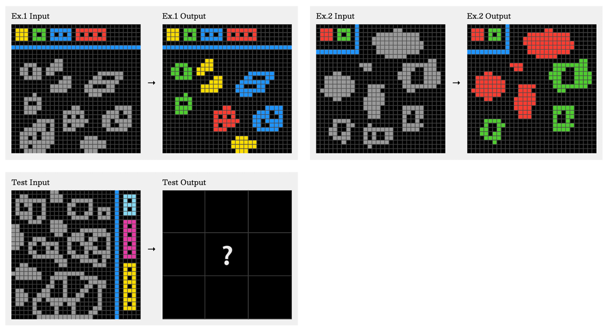

## Bibliographic Information

- title: ARC-AGI-2: A New Challenge for Frontier AI Reasoning Systems
- authors: Francois Chollet, Mike Knoop, Gregory Kamradt, Bryan Landers, Henry Pinkard
- institution: ARC Prize Foundation
- venue / publisher: arXiv
- publication year: 2025
- link / code & data:
  - paper: https://arxiv.org/abs/2505.11831
  - leaderboard: https://www.kaggle.com/competitions/arc-prize-2026-arc-agi-2/leaderboard

---

## TL;DR

- ARC-AGI-1 was designed to measure fluid intelligence in AI and has served as a useful benchmark.
- However, performance is approaching the benchmark's ceiling, calling for an update that also addresses its other limitations.
- ARC-AGI-2 introduces measures to better assess fluid intelligence and provides comparisons with human performance.

---

## Summary

### Introduction

- The philosophy behind ARC-AGI
  - Focus on fluid intelligence in problem solving to resist memorization and overfitting.
  - Require only basic human abilities, such as counting and recognizing symmetry, as prior knowledge.
  - Offer tasks that humans can solve without specific training.
- Earlier competitions
  - The ARC Foundation held its first competition in 2024. A notable finding was the importance of test-time adaptation. GPT-o3 achieved 88% accuracy on ARC-AGI-1, suggesting that performance was approaching the benchmark's ceiling.
- Limitations of ARC-AGI-1
  - It is vulnerable to methods such as brute-force search that do not necessarily reflect intelligence.
  - Without average human scores for individual tasks, their difficulty is hard to assess.
  - Human accuracy of around 97% suggests that the tasks may be too easy.
  - After roughly four years of use, information about the private set's characteristics may have leaked.
- Work on ARC-AGI-2 began in late 2021, guided by the following principles.
  - Keep the same philosophy: tasks should require no knowledge beyond basic priors, such as counting and recognizing symmetry.
  - Keep the same format.
  - Increase resistance to brute-force methods.
  - Collect human performance data.
  - Include tasks across a wide range of difficulty for more precise measurement.
  - Use human performance to balance the public, private, and semi-private sets.

### Human Performance

- Study setup
  - A total of 407 participants took part in groups of 34.
  - Sessions lasted 90 minutes and took place in a conference room.
  - Participants received $115–150 and were told in advance that good performance could earn them a bonus.
- Results
  - 515 tasks.
  - 13,405 pairs attempted; some tasks contained multiple pairs.
  - 1,848 unique pairs.
  - 62% accuracy.
  - An average of 2.3 minutes per pair, or 2.2 minutes for correct responses.

### The Benchmark

- Building the final sets
  - A task was eligible only if at least two participants, working independently, each solved at least one of its test sub-pairs within their first two attempts.
  - The authors reviewed the tasks and removed similar ones.
  - Easier tasks were assigned to the public training set for practice rather than evaluation.
- Model evaluation: accuracy fell from 20–60% on ARC-AGI-1 to 0–3% on ARC-AGI-2.

### Why Is It Harder?

- Removing similar tasks makes each task distinct.
- Tasks contain more complex information.
- The benchmark tests compositional generalization: solving a task requires combining multiple rules.
  - Example 1: consider color, shape, and position while filtering out irrelevant information, all within a single task.
  - Example 2: reason through several steps.
  - Example 3: take the surrounding context into account.

---

## Comments

- The researchers say that psychometrics inspired the ARC-AGI series. For more background, see [ARC-AGI-1: On the Measure of Intelligence](arc-agi-1--on-the-measure-of-intelligence.en.md).
- One difference is that psychometricians do not focus solely on creating test items. They put more effort into developing sound methods for constructing items and identifying the mathematical structure those items form. I wonder whether further progress in the ARC-AGI series might depend on examining the structure shared by its tasks, beyond simply designing better ones.

---

## Takeaways

- AI's problem-solving ability may be weaker than we think, or at least different from what we assume.

---

## Next reading

- [ARC-AGI-3](arc-agi-3.en.md)

---

#AI #evaluation #benchmark
