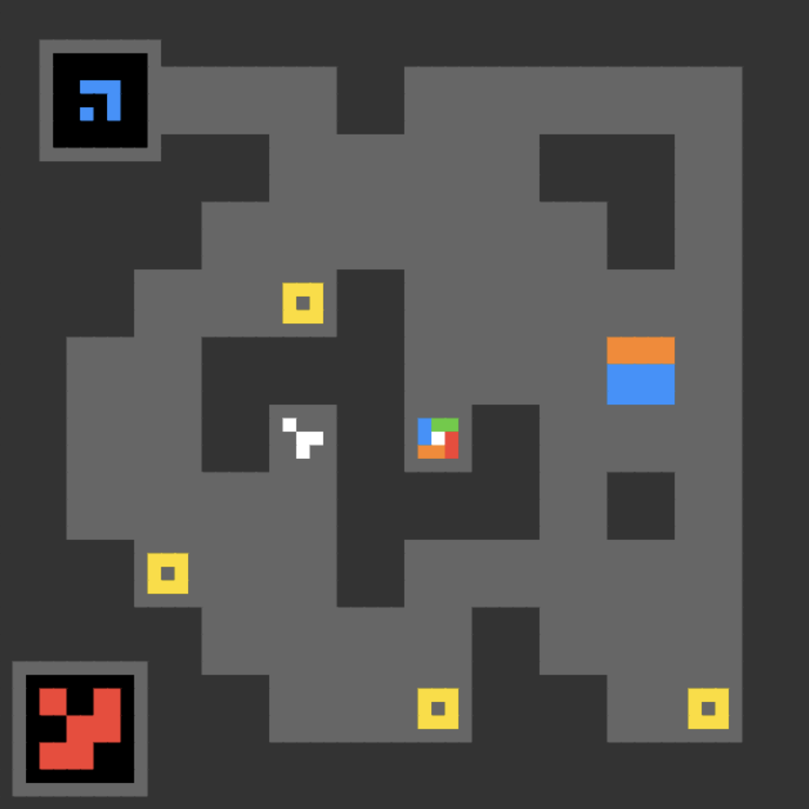

## Bibliographic Information

- title: ARC-AGI-3: A New Challenge for Frontier Agentic Intelligence
- authors: Hunter Henry, David Wexler, Derek Smith, Benjamin Morgan, Vadym Andriianov, Fraser Scott, Pablo Romero Saavedra, Jonathan Pappas, Flynn Swainston-Calcutt, Tom Elliot, Kevin Johnson, Bryan Landers, Gregory Kamradt, Mike Knoop, François Chollet
- institution: ARC Prize Foundation
- venue / publisher: arXiv
- publication year: 2026
- link / code & data:
  - paper: https://arxiv.org/abs/2603.24621
  - leaderboard: https://arcprize.org/leaderboard
  - try the tasks: https://arcprize.org/tasks

---

## TL;DR

- As AI advances, methods for measuring intelligence need to adapt. Measuring the gap between human and artificial intelligence is becoming particularly important.
- Recent AI systems improve their problem-solving abilities through multi-turn reasoning that involves interacting with an environment.
- Building on ARC's philosophy, ARC-AGI-3 proposes a new benchmark for measuring this ability.

---

## Summary

- Before reading further, visit the official site and try the public tasks yourself: https://arcprize.org/tasks

### Earlier ARC-AGI Benchmarks

#### ARC-AGI-1 and 2

- The ARC-AGI series was designed to measure the ability to acquire knowledge, rather than the amount of knowledge already acquired. In other words, it measures fluid rather than crystallized intelligence. *(Author's note. Crystallized intelligence is the ability to use accumulated knowledge and experience. Fluid intelligence is the ability to reason through and solve unfamiliar problems with less reliance on existing knowledge.)*
- ARC-AGI-1 was created in 2019, with preventing shortcuts through memorization as its primary goal.
- ARC-AGI-2 was designed to assess more complex problem solving, such as multi-step reasoning and applying multiple rules, and was released in 2025.

#### Key Findings from ARC-AGI-1 and 2

- LLM-based systems began to show at least some fluid intelligence with test-time reasoning. Systems such as GPT-o3, which spend longer thinking at inference time, introduced the paradigm of large reasoning models (LRMs) and accelerated improvements in AI capabilities.
- However, LRMs have two limitations.
  - They rely on the domain knowledge already held by the model.
  - They work only when the domain environment can provide accurate feedback (e.g., coding tasks).
- This is why LLMs are often described as having "jagged intelligence": their abilities vary inconsistently across domains.
- Improving LRM performance across the board would therefore require tackling many domains individually. It is difficult to regard LRMs as general intelligence with a general capacity to learn.
  - Human reasoning, by contrast, can operate without domain knowledge or precise feedback.
- If these systems have so little general intelligence, how do they solve ARC tasks? The authors attribute this ability to training on large amounts of generated ARC-like problems. In other words, the systems solve ARC through memorization rather than pure reasoning.
  - As one piece of evidence, Gemini 3 mapped green to 3 and red to 6 in an ARC task. This mapping appeared only in the solution, not in the problem.
- Conclusion: private benchmark tasks must be strictly out-of-distribution (OOD) relative to the public tasks.

### ARC-AGI-3

#### Goals

- ARC's primary goal is to capture the gap between human intelligence and current AI. As AI continues to advance, that gap will change. Each version of ARC therefore targets a different gap.
- ARC-AGI-3 targets multi-turn reasoning through interaction with an environment. It measures four functional components.
  - Exploration: actively exploring the environment to gather necessary information.
  - Modeling: extracting general patterns from individual observations.
  - Goal setting: identifying goals from the environment without explicit instructions.
  - Planning and execution: proceeding while revising plans based on newly discovered information.
- To assess these four components, ARC-AGI-3 provides no explicit goals or instructions.
- ARC-AGI-3 also defines intelligence in terms of efficiency. It assesses how efficiently these four abilities operate through the following measures.
  - Indiscriminate attempts, such as brute-force search, lower the score; solving a task in fewer attempts earns a higher score.
  - Human performance provides a baseline for efficiency.

### Development Process

- Building interactive environments required developing games.
- Task creation pipeline
  1. Specification: propose the task concept and how the environment works.
  2. Internal: implement a prototype.
  3. External: have human participants try the task; humans should generally be able to solve it.
  4. Done: register it as a candidate task.
- Key considerations
  - Require only the following basic priors.
    - Objectness: elements should maintain consistent forms and move consistently.
    - Basic geometry and topology: require only basic geometric intuitions, such as symmetry and rotation.
    - Basic physics: require only basic physical intuitions, such as gravity, inertia, and elasticity.
    - Agentness: it should be possible to interpret certain objects as moving with intent.
    - No language or cultural symbols: exclude these because they can be learned through pretraining.
  - Other requirements
    - Novelty: use environments not found in existing video games, to prevent prior exposure through pretraining.
    - Humans should be able to solve a task in roughly 20 minutes.
    - Understanding the task should be easy; solving it should be difficult.
    - Provide easy, tutorial-like levels to introduce the task. Each environment has up to six difficulty levels.
    - Each task should involve multiple rules.
- Tasks must pass two quality assurance (QA) processes.
  - Environment QA
    - First, check basic functionality, including loading, compilation, and runtime behavior.
    - Then, test whether roughly 50,000–1,000,000 random steps can solve the task. If they can, discard it as vulnerable to brute force.
  - Graph analysis
    - Represent possible states as nodes and the actions available from each state as edges.
    - Calculate metrics such as the number of possible states, the presence of cycles, and maximum depth.
    - Use these metrics to estimate difficulty, particularly the likelihood of solving the task through random steps.

### Scoring in ARC-AGI-3

- Performance is scored as follows.
  - Using fewer steps relative to humans earns a higher score.
  - More difficult tasks receive greater weight.
  - The final score is a weighted average across all environments.
  - A small adjustment prevents an unusually high score in one environment from distorting the average.

### Human Performance Data

- Humans can solve every environment in ARC-AGI-3. This means that, for each environment, at least one person completed every difficulty level.
- Study setup
  - Participants worked on nine environments over 90 minutes and received $115–140.
  - After 20 minutes on a task, they were prompted to wrap up. After 30 minutes, the task ended automatically and they moved to the next one.
  - Each environment could be attempted only once, and participants could not return to earlier levels, to prevent the use of prior experience.
- Overall: 486 participants, 414 environments, and 2,893 attempts at solving an environment.
- The human baseline for each task—the value used in the scoring method above—was set using a representative value.

### Conclusion

- ARC-AGI-3 asks how efficiently AI can acquire new skills in an unfamiliar environment using only basic priors: exploring, understanding rules, setting goals, and developing and revising plans.

---

## Comments

- Honestly, I feel the series has started to lose sight of its original purpose and focus on "coming up with harder problems."
  - ARC-AGI-1 explicitly aimed to "measure fluid intelligence," whereas ARC-AGI-3 aims to "measure the gap between human and artificial intelligence." Yet there is little argument for why fluid intelligence alone should fully explain that gap. Intelligence is a complex, multilayered concept; I find it difficult to reduce it to "human–AI gap = fluid intelligence."
- Put differently, ARC's appeal was its attempt to define AI intelligence clearly and build a reasonable benchmark to measure it. I admired this direct approach to measuring intelligence. With version 3, however, it openly calls AI intelligence measurement a "moving target" and seems to give up on that conceptual clarity. I find this somewhat disappointing. Continually finding novel problems that humans can solve but AI cannot may be valuable, but it does not seem to directly measure AI intelligence...
  - From an engineering perspective, though, analyzing observable behavior rather than measuring an underlying concept may be more useful for improving AI. Investigating fundamentals and solving the problem at hand are somewhat different pursuits.
- From this perspective, I also find the definition of intelligence in terms of efficiency unsatisfying. Efficiency is only one aspect of intelligence; I do not think it can serve as the basis for defining it. This is not an adequate conceptualization of intelligence. For an intuitive example, a composer's musical intelligence cannot be defined solely in terms of efficiency.
  - Again, I suspect this reflects a shift away from measuring intelligence directly and toward measuring AI's usefulness.
- Another concern, perhaps a minor one, is that equating fewer actions with greater efficiency seems too simplistic. If an AI generates an enormous number of tokens for a single action, it is hard to call that efficient. I understand the practical limitation: when using an API, the number of generated tokens may not be available. Even so, I think we should avoid claiming to measure a broader concept than we actually measured.

---

## Takeaways

- null

---

## Next reading

- [AVO](avo.en.md) ([paper](https://arxiv.org/abs/2603.24517))

---

#AI #benchmark #evaluation #llm
