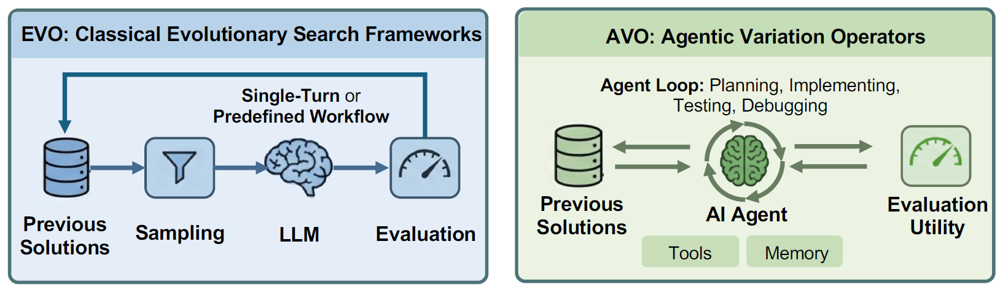

## 서지 정보

- 제목: AVO: Agentic Variation Operators for Autonomous Evolutionary Search
- 저자: Terry Chen∗, Zhifan Ye∗, Bing Xu∗, Zihao Ye, Timmy Liu, Ali Hassani, Tianqi Chen, Andrew Kerr, HaichengWu, Yang Xu, Yu-Jung Chen, Hanfeng Chen, Aditya Kane, Ronny Krashinsky, Ming-Yu Liu, Vinod Grover, Luis Ceze, Roger Bringmann, John Tran, Wei Liu, Fung Xie, Michael Lightstone, Humphrey Shi
- 기관: NVIDIA
- 발표 / 출판: arXiv
- 출판 연도: 2026
- 링크 / 코드·데이터:
	- 논문: https://arxiv.org/abs/2603.24517

---

## 세 줄 요약

- 진화적 탐색에서 가장 중요한 것은 더 나은 (혹은 최소한 새로운) 해법을 생성하는 것인데, 이 생성을 요새 LLM들이 담당하고 있다.
- 그런데 LLM의 능력이 많이 발전된 지금, 생성만 맡기는 것은 아쉽다.
- CUDA 커널의 자가 개선을 예시로 삼아, 사전 제약이 거의 없이 LLM 에이전트가 진화적 탐색을 자율적으로 수행해도 성능 향상을 이룰 수 있다는 것을 보인다.

---

## 요약

### Introduction
- 최근 진화적 탐색 시스템에서 LLM이 활발하게 사용되고 있으나, LLM의 역할은 고정된 파이프라인에서 새로운 후보를 생성하는 것에 그치고 있다. (e.g., AlphaEvolve) 다시 말해, 우리는 LLM의 다양한 능력을 충분히 활용하고 있지 않다. 이를 극복하기 위해서는 LLM 기반 에이전트가 워크플로우 형태 자체를 변형하도록 허용해야 한다.
- 이 논문은 AVO(Agentic Variation Operators)를 제안한다. AVO는 다음과 같은 특징을 지닌다.
	- 주어진 환경적 요소 이용 가능. e.g., 이전 해법들, 지식 베이스, 평가 도구.
	- 독립적으로 워크플로우 결정. e.g., 수정 대상과 시점, 평가 대상과 시점.
- AVO의 유용성을 보이기 위해 Blackwell B200 GPU 위에서의 multi-head attention 커널 최적화에 적용한다. AVO가 7일이 넘는 자가 개선 이후에 찾아낸 해법은 cuDNN 대비 최대 3.5%, FlashAttention-4 대비 최대 10.5% 개선되었다. (i.e., 1668 TFLOPS at BF16 precision) 또한, 이 해법은 multi-head attention에 과적합되지 않았으며, 간단한 변형 이후에 grouped-query attention에서도 사용 가능할 정도로 일반적이었다.
### Background
#### 진화적 탐색과 변이연산
- 진화적 탐색이란 이전의 해법-점수 쌍들을 보고 새로운 해법을 만들어내는 과정을 말한다. 기본적으로 아래의 단계를 포함한다.
	- 샘플링: 새로운 해법을 만들기 위해 참고할 이전 결과들을 고름.
	- 생성: 고른 결과들을 토대로 새로운 (그리고 원하건대 더 나은) 해법을 제안.
	- 평가: 제안된 해법에 점수를 매김.
- 그리고 샘플링 + 생성을 변이연산이라고 부른다.
- 지금까지는 LLM이 생성에 자주 사용되었다. 그러나 LLM은 생성 이외의 작업도 수행할 능력이 있다.
#### 현대 GPU의 어텐션 커널
- 어텐션은 입력 길이 $N$에 따라 연산량이 이차적으로 증가한다. 왜냐하면 $N \times N$ 행렬을 계산해야 하기 때문.
- FlashAttention은 이 연산을 GPU에서 효율적으로 수행하기 위해 행렬을 조각내어 각 조각을 최종 어텐션 결과값을 업데이트하는 것에 쓰고 버린다.
- FlashAttention은 이 전략을 바탕으로 계속 발전해 왔다. 최근 버전들에서는 warp specialization이라는 방법을 도입했는데, 핵심은 각 warp에 특정한 역할을 부여해서 전체 연산을 비동기로 처리하는 것이다. 다시 말해, 각 warp는 다른 작업이 끝나기를 기다리지 않고 자신의 대기열에 놓인 작업들을 바로바로 수행한다. *(작성자 주. 당연히 다른 작업이 완료되기를 기다렸다가 동기화해야 하는 경우도 있다. 예를 들어 여러 결과값을 더해야 한다든지... 동기화가 적을수록 warp들이 대기 없이 계속 작업할 수 있기 때문에 FlashAttention은 동기화가 적어지도록 계산 알고리즘을 재설계한다.)*
- FlashAttention 버전 4는 Blackwell에 맞춤으로 고도화되어 추가적인 개선을 꾀하는 것이 어려운 수준에 다다랐다. i.e., 우리가 풀려는 문제는 진짜 어려운 문제다!

### AVO

AVO는 진화적 탐색을 (i.e., 샘플링, 생성, 평가) 고정된 파이프라인 없이 에이전트 기반으로 실행한다. 졍확히는 탐색 에이전트와 감독 에이전트가 있다.

#### Formulation
- 기본 변수들
	- $\mathfrak{X}$ : CUDA 커널들의 공간
	- $x_i \in \mathfrak{X}$ : $i$번째 CUDA 커널
	- $f_j$ : $j$번째 평가 함수 e.g., TFLOPS가 얼마인가?
	- $\mathbf{f}(x_i) = (f_1(x_i), ..., f_n(x_i))$ : $x_i$의 평가 결과 벡터
	- $\mathcal{P}_t = \{(x_1,\mathbf{f}(x_1)), ..., (x_t,\mathbf{f}(x_t))\}$ : 시점 $t$ 까지의 모든 커널-평가 쌍들
	- $\mathfrak{P}$ : 커널-평가 쌍의 유한 집합들이 이루는 공간 ($\mathcal{P}_t \in \mathfrak{P}$)
- 진화적 탐색의 기본 연산들
	- $\mathrm{Sample}: \mathfrak{P} \to \mathfrak{P}$ : 커널-평가 쌍 중에 일부를 선택하기
	- $\mathrm{Generate}: \mathfrak{P} \to \mathfrak{X}$ : 주어진 커널-평가 쌍 집합을 참고해서 새로운 커널을 생성하기
	- $\mathrm{Vary}(\mathcal{P}) = \mathrm{Generate}(\mathrm{Sample}(\mathcal{P}))$ : 기본적인 변이연산
- AVO가 기본 연산을 넘어 하고 싶은 것
	- $\mathrm{Vary}(\mathcal{P}) = \mathrm{Agent}(\mathcal{P},\mathcal{K},\mathbf{f})$
	- 여기에서 $\mathcal{K}$는 지식 베이스로 CUDA 설명서, PTX ISA 문서, Blackwell 구조, 기존 커널 구현이 담겨 있다.
	- 즉, AVO는 지식 베이스를 기반으로 자가 개선이 일어나는 시스템을 만들고자 한다.

#### 변이 단계의 자율성
- 저자들은 AVO에서 하나의 변이연산이 여러 개의 세부 단계로 이루어지는 것을 관찰했다. 탐색 에이전트는 이전 결과들을 토대로 문제점과 개선 지점을 도출하고, 새로운 제안을 작성하고, 작성된 제안을 평가했다. 그리고 평가 결과가 나쁘면 원인을 진단하여 다시 개선안을 내 놓았다.
- 단, 탐색 에이전트는 어떤 $x$를 $\mathcal{P}$에 새로 추가할 권한이 없다. 제안된 해법이 정확성 검사를 통과하고 현재 가장 좋은 해법과 점수가 같거나 더 높은 경우에만 규칙 기반으로 추가된다.

#### 연속적 진화
- AVO는 단일 계보를 유지한다. 각 커널을 점수와 함께 git에 커밋하는 식으로 계보를 관리하는데, 브랜치를 따거나 일부 히스토리를 아카이브하는 것은 하지 않는다.
- 그런데 단일 계보를 유지하면 아래처럼 답보 상태에 빠졌을 때 탈출하지 못할 수 있다.
	1. 탐색 정체: 탐색 중인 방향에서 개선 지점을 찾지 못함
	2. 비생산적 반복: 계속 코드를 수정하긴 하는데 점수는 안 오름
- 그래서 AVO는 이런 문제가 발생했을 때 탐색 에이전트가 새로운 방향을 탐색하도록 유도하는 별도의 감독 에이전트가 있다.
- AVO는 multi-head attention 커널의 최종 버전을 작성하기까지 7일의 시간과 40개의 커밋이 수반되었다. 이 과정에서 탐색 에이전트는 새로운 해법을 제안할 시점, 이전 결과를 참고할 시점, 전략을 수정할 시점을 자율적으로 판단했다. 물론, 답보 상태에서는 감독 에이전트의 도움을 받았다.

### 실험

#### 실험 준비
- **에이전트:** NVIDIA가 자체 개발한 코딩 에이전트 사용. 별도의 튜닝이나 특별 지시 사항은 없었음.
- **하드웨어 및 소프트웨어:** NVIDIA B200 + CUDA 13.1 + PyTorch 2.10.0.
- **베이스라인:** cuDNN과 FlashAttention-4를 비교 대상으로 삼음.
- **벤치마크:** BF16 정밀도, head dimension 128, 시퀀스 길이 4K-32K. 총 토큰 수는 32K로 고정하고 배치 크기를 조절. MHA는 16개 head, GQA는 32개 query head와 4개 또는 8개 KV head 사용. 각각 causal/non-causal 조건에서 forward pass의 처리량(TFLOPS)을 측정.

#### 결과
- Causal MHA에서 cuDNN 대비 0.4% - 3.5%, FlashAttention-4 대비 5.0% - 10.5%의 성능 개선
- 이 결과가 일반화 가능한 결과인지 궁금해서 AVO에게 MHA 솔루션을 주고 GQA를 지원하도록 바꾸라고 했다. AVO는 30분의 작업으로 이를 해냈다. 이 커널은 causal GQA에서 cuDNN 대비 최대 7.0%, FlashAttention-4 대비 최대 9.3%의 개선을 보였다. Non-causal GQA에서는 각각 최대 6.0%, 4.5% 개선되었다.

#### 진화 궤적의 핵심 요약
- 대량 탐색: 7일간 커밋된 커널은 40개이지만 AVO가 만든 버전은 500개 이상이었다. 인간의 효율을 가볍게 능가.
- 성능 도약: 성능이 선형으로 증가하는 것이 아니라 몇몇 시도들에서 갑자기 크게 도약.
- 개선 감소: 후반부로 갈수록 개선폭이 작아짐.

### 최종 해법 분석
- 아래 세 가지 발견이 제일 중요하다.

| 새로운 발견                                  | 버전        | 성능 향상 (Non-causal) | 성능 향상 (Causal) |
| --------------------------------------- | --------- | --------------------- | ----------------- |
| Branchless accumulator rescaling        | v19 → v20 | +8.1%                 | +1.6%             |
| Correction/MMA pipeline overlap         | v29 → v30 | +1.1%                 | +0.4%             |
| Register rebalancing across warp groups | v32 → v33 | +2.1%                 | ~0%               |

#### 발견 1. Branchless accumulator rescaling
- 문제: 온라인 softmax *(작성자 주. 온라인 softmax가 궁금하면 [FlashAttention-1](flashattention-1.ko.md) 추천!)* 에서는 row-wise 최대값을 갱신하는 단계가 있다. 기존 구현은 최대값 갱신 여부를 판단하는 분기를 만들었다. 갱신할 필요가 없다면 건너뛰는 방식. 그런데 분기 계산은 매번 모든 행의 업데이트 필요 여부를 확인한다는 것을 의미한다. 즉, 일종의 동기화이다. (앞서 말했듯이 동기화 단계가 많아질수록 비동기의 이점은 사라진다.)
- 해결: 분기를 없애기 위해 무조건 연산한다. 단, 갱신 필요가 없을 때에는 1을 곱한다. 의사 코드로 보자면 이런 식이다.
	- BEFORE: `if need_update: output_O = output_O*scaler`
	- AFTER: `scaler = factor if need_update else 1; output_O = output_O*scaler`

#### 발견 2. Correction/MMA pipeline overlap
- 문제: AVO가 만든 기존 커널은 두 개의 Q-tile을 함께 처리하는데, 이때 'PV-GEMM-1 -> PV-GEMM-2 -> Correction-1 -> Correction-2' 순서대로 처리했다. Correction은 온라인 softmax에서 $O$를 업데이트하는 것을 의미.
- 해결: PV-GEMM-1이 끝나면 곧바로 Correction-1을 PV-GEMM-2과 동시에 수행한다. 둘은 GEMM과 Correction은 서로 다른 warpgroup이 처리하기 때문에 겹쳐도 과부하되지 않음.

#### 발견 3. Register rebalancing across warp groups
- 문제: correction warpgroup들에서 register 부족으로 훨씬 느린 메모리를 사용 중이었다. 반면에 softmax warpgroup들은 register가 여유 있었음.
- 해결: softmax warpgroup의 register들을 correction warpgroup들로 옮겨주기.

### 결론
- 여러 요소가 상호작용해서 하나를 건드리면 다른 것들도 바뀌는 복잡한 상황에서도 개선을 이루어낸 점이 참 장하다.
- MHA를 타겟으로 했음에도 GQA에 확장 가능한 해법을 찾아낸 것도 참 장하다.

---

## 읽고 든 생각

- 기존 시스템을 실제로 개선한 것은 큰 의미가 있다고 생각함.
- 그런데 AVO에게 주어진 상황과 그것이 해결한 문제를 정확히 이해하는 것이 좋을 것 같음.
	- AVO가 한 것은 발명보다는 개선인 것 같음. 왜냐하면 1) AVO는 저자들의 말마따나 '아주 좋은 소프트웨어들'을 베이스라인으로 제공 받았다. 2) 새로운 상황이나 제약 조건이 추가되지 않아서 기존 시스템에 큰 전환을 가할 일이 없었다.
	- 반면, FlashAttention의 저자들이 여러 논문에 걸쳐 줄곧 주장하는 '효율화'는 효율적 개선이 아니라 효율적 발명에 가까운 것 같다. 다시 말해, 있는 걸 개선하는 것보다 새로운 조건이 추가되었을 때 그 조건에 대응할 수 있는가 하는 문제. 예를 들어 새로운 모델이 나오고, 새로운 칩이 나오고, 사용자들의 사용 패턴도 크게 달라졌을 때, 이에 적합한 알고리즘과 소프트웨어를 자동으로 생성할 수 있는가 하는 문제인 듯. 이에 대해 AVO가 답이 되지는 않는 것 같다.
	- 최근 LLM이 인간이 풀지 못했던 수학 문제들을 증명하는 것을 보면 개선이 아닌 발명도 충분히 가능할 것 같긴 하다. 그런데 AVO의 백본인 'NVIDIA 자체 개발 코딩 에이전트'의 수준을 알 수가 없으니 가능성이 얼마나 될런지는 모르겠다.
- 또 궁금한 것은 AVO의 결과를 다시 AVO에 넣으면 개선이 있을 것인지? 7일밖에 안 걸리는 실험이라 해 봤을 것 같은데 결과가 공유되지 않아 아쉽다. 만약에 개선이 없었다면 그 원인은 AVO가 발명용이 아니라 개선용이라서 돌파구를 찾지 못 해 그런 게 아닐까 싶다.
- 마지막으로 세 가지 주요 발견은 ablation을 제대로 하면 좋을 것 같다.

---

## 배운 점

- 이미 공정 최적화는 LLM 기반 에이전트로 충분히 풀 수 있는 문제가 된 것 같다. 논문으로 나올 정도면 내부 기술력은 더 쌓여 있을 듯.

---

## 다음 읽을 것

- null

---

#AI #LLM #agent #evolutionary_search #GPU #attention #hardware #machine_learning_system #efficiency #evaluation #code_generation #parallel_computing #kernel_optimization
