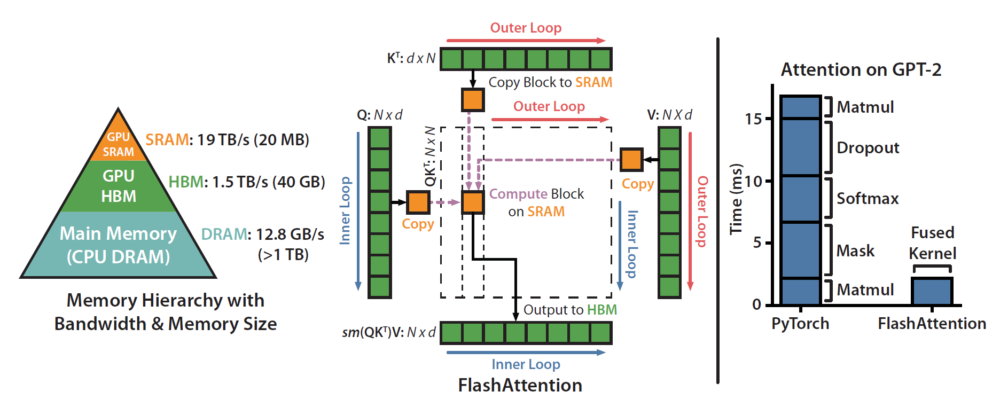

## Bibliographic Information

- title: FlashAttention: Fast and Memory-Efficient Exact Attention with IO-Awareness
- authors: Tri Dao, Daniel Y. Fu, Stefano Ermon, Atri Rudra, and Christopher Ré
- institution: Stanford University; University at Buffalo, SUNY
- venue / publisher: NeurIPS
- publication year: 2022
- link / code & data:
  - paper: https://proceedings.neurips.cc/paper_files/paper/2022/hash/67d57c32e20fd0a7a302cb81d36e40d5-Abstract-Conference.html
  - code: https://github.com/Dao-AILab/flash-attention

---

## TL;DR

- Many approaches approximate attention, a major bottleneck in Transformers, to reduce computation.
- But the real bottleneck is often the volume of data moving through GPU memory, not the amount of arithmetic.
- FlashAttention accepts extra computation to reduce memory traffic, making exact attention faster and more memory-efficient.

---

## Summary

### Introduction

- Transformers are becoming increasingly influential.
- Yet the memory complexity of self-attention, their core component, grows quadratically with sequence length.
- Approximate attention methods have been proposed to reduce computational complexity. Most, however, have failed to deliver faster execution despite reducing the operation count.
- The reason is that they do not account for I/O between high-bandwidth memory (HBM) and on-chip SRAM. *(Author's note. In a GPU, HBM is a large but relatively slow memory used to store large amounts of data such as model parameters, while SRAM is a small but fast memory used to temporarily hold data that will be reused multiple times during computation. The actual computation is performed by separate compute units. These compute units can read the data they need directly from HBM, or temporarily store data in SRAM when the same data needs to be reused multiple times.)* Standard implementations store intermediate results in HBM. The intuition is natural: why discard a result when it could be saved and reused? But writing and reading those results in slower memory becomes a bottleneck. Reducing HBM traffic can be worthwhile even if it requires extra computation.
- FlashAttention puts this idea into practice.

### Background

#### Hardware

- GPU compute throughput has grown much faster than memory bandwidth. Memory reads and writes are therefore becoming a bottleneck.
- GPUs execute kernels using many threads in parallel. Each kernel loads data from HBM, performs its computation, and writes the results back to HBM.
- **Kernel fusion** combines operations so they can reuse data loaded from HBM, reducing memory accesses. *(Author's note. Consider ReLU(x + b). Without fusion, one kernel computes t = x + b and writes t to HBM. Another reads t, computes y = ReLU(t), and writes y to HBM. A fused kernel performs both operations together, eliminating the intermediate round trip. Fusion is not always beneficial or straightforward, though: an intermediate result may be worth retaining, or operations may require global synchronization, such as a sum or mean across independently executing blocks.)*

#### Standard Attention Implementation

- **Algorithm 0** is the basic implementation. Moving large intermediate matrices to and from HBM creates a memory I/O bottleneck.

  > Inputs: $Q,K,V \in \mathbb{R}^{N \times d}$ reside in HBM.
  >
  > 1. Load $Q$ and $K$ from HBM. Compute $S=QK^\top$ and write $S$ to HBM.
  > 2. Read $S$ from HBM. Compute $P=\mathrm{softmax}(S)$ and write $P$ to HBM.
  > 3. Load $P$ and $V$ from HBM. Compute $O=PV$ and write $O$ to HBM.
  > 4. Return $O$.

- Going beyond the paper, here is a simplified view of the [2022 PyTorch/CUDA implementation](https://github.com/pytorch/pytorch/blob/v1.12.1/aten/src/ATen/native/cuda/SoftMax.cu). The exact kernel choice also depends on dtype and layout. Feel free to skip these details.

  > 1. Compute $S$.
  >    - A GEMM (general matrix multiplication) kernel loads blocks of rows $Q_I$ and $K_J$ from HBM, computes $S_{I,J}=Q_IK_J^\top$, and writes this block of $S \in \mathbb{R}^{N \times N}$ to HBM.
  >    - Threads process different row and column blocks in parallel, assembling the full $S$ in HBM.
  > 2. Compute $P=\mathrm{softmax}(S)$.
  >    - A softmax kernel reads $S$ from HBM and applies softmax row by row.
  >    - For $N \le 1024$:
  >      - In the warp-based path, a row is processed within a warp, with multiple warps running in parallel. *(Author's note. A warp is a hardware-scheduled group of 32 threads that execute a common instruction on different data, such as adding 1 to elements of a row.)*
  >      - Each thread is assigned a disjoint subset of the row's elements.
  >      - Each thread computes its local maximum.
  >      - A warp-wide max reduction produces the row maximum $m_i$.
  >      - Threads compute $e^{S_{ij}-m_i}$, then perform a sum reduction to obtain the normalization denominator.
  >      - Each value is divided by that denominator to obtain $P_{ij}$, and the results are written to HBM.
  >    - For $N > 1024$:
  >      - One thread block handles a row, with several warps cooperating. *(Author's note. A thread block is a programmer-defined group of cooperating threads. Threads in the same block can share memory and synchronize with one another.)*
  >      - Each thread computes a local maximum over its assigned elements. A block-wide reduction then produces $m_i$.
  >      - Threads reread the row elements and compute local sums of $e^{S_{ij}-m_i}$. A block-wide sum reduction produces the denominator.
  >      - They reread the elements once more, compute the softmax values, and write $P$ to HBM. This path rereads the input rather than keeping the entire row in registers.
  > 3. Compute $O=PV$.
  >    - A GEMM kernel loads blocks of $P$ and $V$ from HBM, computes $O$, and writes it to HBM.
  > 4. Return $O$.

### FlashAttention

- The implementation follows two principles.
  - Compute exact attention without approximation.
  - Reduce HBM traffic to reduce wall-clock time.
- The key idea is not to write $S$ or $P$ to HBM. Their blocks are used to compute $O$, then discarded.
  - Loading blocks of $Q,K,V$ from HBM is still necessary. What changes is how $S$ and the subsequent results are handled.
- How is this possible? Softmax is the main obstacle because it requires reductions across each row: a maximum and a normalization sum. At first, it seems that all row elements must be available before these quantities can be computed. In other words, it appears necessary to finish $S$ and store it in HBM before computing $P$.
- FlashAttention addresses this with online updates. In simplified terms, whenever the kernel computes a block $S_{I,J}=Q_IK_J^\top$, where $Q_I \in \mathbb{R}^{B_r \times d}$ and $K_J \in \mathbb{R}^{B_c \times d}$, it updates three quantities and writes the updated blocks back to HBM.
  - Here $B_r$ is the number of rows in the $Q$ block and $B_c$ is the number of rows in the $K$ block, so each block $S_{I,J}$ computed at once is $B_r \times B_c$.
  1. Update the vector of row maxima $m$.
  2. Update the softmax normalization sums $l$, rescaling them to account for the new $m$.
  3. Update the output $O$ using the revised normalization.
- Once all blocks of $S$ have been processed, the final output $O$ is complete.
- Instead of materializing the full $N \times N$ matrices $S$ and $P$ in HBM, the algorithm maintains only the row statistics $m,l$ and the $N \times d$ output $O$, updating them block by block.
- More intuitively, each small block of $Q,K,V$ loaded from HBM produces a "mini attention" result. This updates the running attention state loaded from HBM. The updated state is written back, and the temporary result is discarded. Only the information needed for subsequent updates is retained, reducing the memory bottleneck.
- Maintaining $m,l$ alongside $O$ adds $O(N)$ auxiliary storage for the row statistics. This is a worthwhile trade-off: reducing HBM traffic has a greater effect on wall-clock time.
- Training introduces one more consideration. The backward pass needs $S$ and $P$, but they have been discarded to save memory. They are recomputed block by block from $Q,K$ using the saved softmax statistics, while $O$ is retained for gradient computation. The extra computation costs less than transferring those large intermediates to and from HBM.

### Experiments

- Resource use
  - More computation: 66.6 GFLOPs for standard attention -> 75.2 GFLOPs for FlashAttention.
  - Less HBM read/write traffic: 35.3 GB -> 4.4 GB.
- Faster training
  - BERT-large: 20 minutes with NVIDIA's MLPerf 1.1 implementation -> 17.4 minutes with FlashAttention.
  - GPT-2 medium: 21 days with Hugging Face -> 6.9 days with FlashAttention.
- The memory saved can instead be used to support longer contexts.

### Limitations and Future Directions

- The authors' CUDA implementation is complex and difficult to port. Multi-GPU systems introduce more complicated I/O, which may make the approach harder to apply. A future goal is to express these optimizations through a higher-level interface such as PyTorch.
- The same approach could be used to optimize other Transformer operations beyond attention.

---

## Reflections

- There is something deeply satisfying about engineering that solves a real, important problem.

---

## Takeaways

- Lately, I have been wondering whether ML engineers now need a solid understanding of hardware as well. The ability to design implementations around the underlying hardware may become a defining engineering skill.

---

## Next reading

- [FlashAttention-2](flashattention-2.en.md)

---

#AI #hardware #machine_learning_system #attention #GPU #efficiency #LLM #transformer #memory_optimization #kernel_optimization
