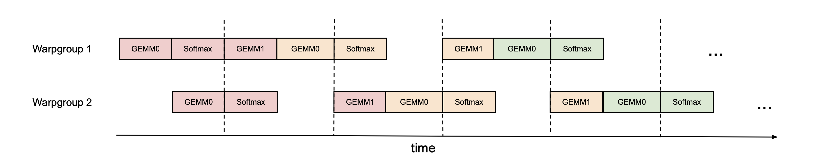
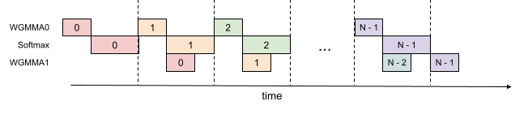
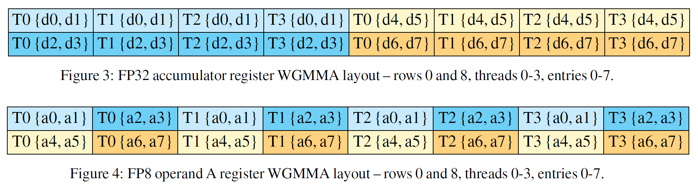

## Bibliographic Information

- title: FlashAttention-3: Fast and Accurate Attention with Asynchrony and Low-precision
- authors: Jay Shah, Ganesh Bikshandi, Ying Zhang, Vijay Thakkar, Pradeep Ramani, and Tri Dao
- institution: Colfax Research; Meta; NVIDIA; Georgia Institute of Technology; Princeton University; Together AI
- venue / publisher: NeurIPS
- publication year: 2024
- link / code & data:
  - paper: https://proceedings.neurips.cc/paper_files/paper/2024/hash/7ede97c3e082c6df10a8d6103a2eebd2-Abstract-Conference.html

---

## TL;DR

- FlashAttention-2 did not fully use Hopper's support for asynchronous execution and low-precision computation.
- FlashAttention-3 uses asynchronous scheduling to raise H100 utilization from roughly 35% to over 80%.
- It also addresses data layout and quantization issues so FP8 computation can run efficiently with less numerical error.

---

## Summary

- I will skip the background on FlashAttention-1 and 2. If needed, start with the earlier posts.
  - [FlashAttention-1](flashattention-1.en.md)
  - [FlashAttention-2](flashattention-2.en.md)

### Introduction

- Self-attention is a major bottleneck in Transformers because its computational cost grows quadratically with sequence length. As inputs get longer—large codebases, long conversation histories, high-resolution video—making attention faster becomes more important.
- FlashAttention-1 and 2 address this problem.
  - FlashAttention-1: reduce memory reads and writes, avoiding large intermediate matrices in HBM.
  - FlashAttention-2: improve work distribution to keep the compute units busy.
- Yet FlashAttention-2 reaches only about 35% utilization on the H100, compared with 80–85% for optimized GEMM kernels. Its design does not explicitly use asynchronous execution or low-precision computation.
  - The A100 already supported some asynchronous operations. The H100 adds a dedicated Tensor Memory Accelerator (TMA) for data movement and asynchronous warpgroup matrix multiplication instructions (WGMMA). Its fourth-generation Tensor Cores also support FP8 matmul, with roughly twice the theoretical throughput of FP16/BF16.
- The goal is to redesign FlashAttention-2 around these capabilities. There are three main changes.
  1. **Producer-consumer asynchrony:** split warps into producers and consumers. Producers issue data loads from HBM; consumers handle computation. This lets data movement and computation overlap.
  2. **Hide softmax under asynchronous GEMM:** attention follows $QK^\top \rightarrow \mathrm{softmax} \rightarrow PV$, or matmul → non-matmul → matmul. Softmax operations have much lower throughput than matmul and can become a bottleneck. Issue GEMMs asynchronously, then perform softmax work from another tile while they run.
  3. **Low-precision GEMM:** use FP8 where it helps, while addressing incompatible data layouts and the loss of numerical accuracy.

### Implementing FlashAttention-3

#### Producer-Consumer Asynchrony

> Pingpong scheduling across two warpgroups. The same color denotes the same iteration over a block of $K,V$. Each warpgroup keeps its own $Q$ tile and updates the corresponding output rows as it processes successive $K,V$ blocks.

- The goal is to overlap data loading with computation. The figure also shows how to overlap computation across consumer warpgroups.
- First, divide the warps within a thread block into producers and consumers.
  - **Producer warpgroup:** load $Q,K,V$ from HBM into shared memory (SMEM).
  - **Consumer warpgroups:** perform computation using the data in SMEM.
  - The producer can load the next block whenever a buffer slot is free, while consumers process blocks that are already available. Synchronization is still needed before consuming data or reusing a slot, but loading and computation can proceed in parallel.
- Next, coordinate the consumer warpgroups with pingpong scheduling, as shown above.
  - Split $Q$ by rows between consumer warpgroups, following FlashAttention-2's approach to work partitioning. Each warpgroup handles its own output rows. *(Author's note. In this configuration, each consumer warpgroup handles a 64-row query tile.)*
  - Within one warpgroup, the sequence is GEMM0 → Softmax → GEMM1, corresponding to $QK^\top \rightarrow \mathrm{softmax} \rightarrow PV$. These operations work on tiles, not the full matrices.
  - While one warpgroup computes softmax, the other runs GEMMs. Softmax uses different execution units from the Tensor Cores, so alternating these roles helps keep the Tensor Cores busy.

#### Overlapping GEMM and Softmax Within One Warpgroup

> Asynchronous scheduling within one warpgroup. The same color denotes the same iteration over a $K,V$ block; the $Q$ tile stays fixed.

- The previous section schedules work across multiple warpgroups. Here, the overlap happens within a single warpgroup.
- The idea is similar: overlap GEMM1 ($PV$) from the current iteration with softmax from the next. Since they use different execution units, they can run concurrently once the necessary inputs are ready.
- There is a catch: the pipeline needs extra registers to hold intermediate results while operations are still in flight. Register use must be balanced against tile size to avoid hurting performance.

#### Low-Precision GEMM with FP8

- FP8 promises faster computation, but introduces two problems.
  1. WGMMA expects different data layouts for FP16/BF16 and FP8.
  2. Quantization reduces numerical accuracy.
- The layout issue can be handled by preprocessing the data to match the dimensions and data types.
- Accuracy requires algorithmic changes. FlashAttention-3 applies two techniques. *(Author's note. Neither technique originated with FlashAttention-3, so the paper gives only a brief explanation. For more detail, it is worth reading the earlier work.)*
  - **Block quantization:** give each block its own scale, so an outlier in one block does not force an unnecessarily large scale on the others. *(Author's note. A scale maps values into the range representable by FP8. The corresponding inverse scaling is applied when reconstructing their magnitude. There are several ways to choose this scale.)*
  - **Incoherent processing:** large models often have outliers concentrated in particular dimensions, which can cause problems with scaling. To eliminate these outliers, multiply $Q,K$ by a random orthogonal matrix $M$, applying a rotation or reflection. In notation: $(QM)(KM)^\top$, with $MM^\top = I$.

### Experiments

- On the H100, FlashAttention-3 is roughly 1.5–2.0× faster than FlashAttention-2 in the BF16 forward pass. For medium and long sequences (1k tokens and above), it also outperforms NVIDIA's H100-optimized cuDNN implementation in the reported BF16 benchmarks.
- Ablations support the benefits of warp specialization and GEMM–softmax overlap. In the FP8 accuracy experiment, block quantization made only a small difference; incoherent processing accounted for most of the error reduction.

---

## Reflections

- More companies seem to be considering their own chips. I wonder whether better AI assistance is lowering the cost of engineering design, making it easier to tackle problems at the hardware level. But manufacturing chips is expensive, and companies need to get their money's worth from them! Frequent replacement seems unlikely. Algorithmic and software solutions like FlashAttention will still have a role.
- The question is how efficiently we can develop these solutions, a concern the authors have raised since FlashAttention-1. How quickly can we adapt whenever new chips arrive and the hardware landscape changes?

---

## Takeaways

- Keep at it! The FlashAttention series is still going.

---

## Next reading

- [AVO](avo.en.md)

---

#AI #GPU #attention #hardware #machine_learning_system #efficiency #quantization