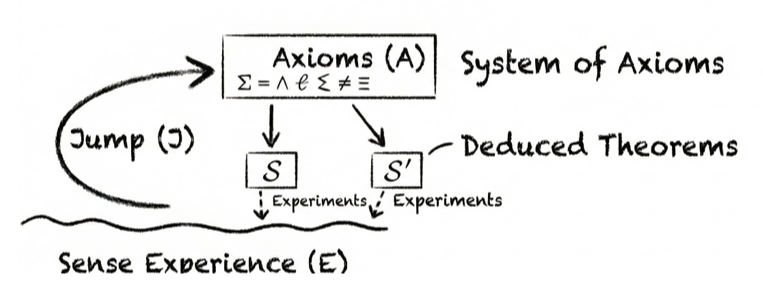

## Metadata

- title: Position: LLMs can’t jump
- authors: Tom Zahavy
- institution: Google Deepmind
- venue / publisher: ICML 2026
- publication year: 2026
- link / code & data: [https://icml.cc/virtual/2026/poster/67091](https://icml.cc/virtual/2026/poster/67091)

---

## TL;DR

- LLMs have difficulty inventing genuinely new things.
- The reason is that while LLMs have deductive and inductive capabilities, they lack abductive capabilities.
- The paper argues that overcoming the abductive limitations of LLMs requires a physically consistent and manipulable world model, and supports this claim using Einstein’s invention of relativity as an example.

---

## Summary

### 1. Introduction

- Science is often thought to advance through the following two modes of reasoning.
  - Induction: discovering rules from individual cases.
  - Deduction: deriving propositions that necessarily follow from given premises.
- However, there is a third mode that is just as important: abduction. Abduction is the process of inferring the principle that could have produced individual cases.
- LLMs are good at induction and deduction but have limitations when it comes to abduction, and a world model is needed to overcome these limitations.

### 2. Background

- In the 19th century, mechanics was regarded as the foundation of all physics. Mechanics explained many phenomena with astonishing precision. Using Newtonian mechanics, scientists had established the equivalence of inertial mass and gravitational mass to an error level of $10^{-9}$.
- The problem was that Newtonian mechanics could not cleanly explain Mercury’s orbit. Scientists tried to preserve their confidence in Newtonian mechanics by assuming that an undiscovered planet called “Vulcan” existed near the Sun.
- In the 20th century, Albert Einstein and Marcel Grossmann were developing a new theory. They came very close to what is now the complete Einstein tensor and expected that they would be able to publish the theory within a few months. However, they then remained stuck for the next two years.
- The bottleneck was Newtonian mechanics. In an attempt to make their theory consistent with this classical theory, they devised ten equations whose meaning was unclear.
- Two years later, Einstein abandoned his previous assumption about restricted coordinate systems and returned to general covariance. Then, in about a month, he completed General Relativity and successfully explained Mercury’s orbit.

### 3. Alternative Views

- **The limits of induction**: Science is often regarded as a discipline of induction. However, the motivation to “discover patterns that explain observations” faces two limitations.
  - Once the error is reduced to the $10^{-9}$ level, there is nothing more to explain. i.e., there is almost no error signal left to optimize.
  - It can produce incorrect patterns that reduce error, such as “Vulcan” or “Einstein and Grossmann’s ten equations.”
- **The limits of deduction**: Deriving new laws from existing laws is a useful method, but it has the following limitations.
  - It is difficult to generate the correct premises themselves.
  - It lacks intent; if Einstein had approached the problem with the goal of explaining only Mercury’s orbit rather than reality itself, would he have reached General Relativity?

### 4. Abduction

- Abduction consists of the following two stages.
  1. Imagine hypothetical observations through mental simulation.
  2. Derive a general principle through reasoning.
- Examples
  - Einstein imagined “a physicist inside an elevator uniformly accelerating through space” and used this to build the foundation of relativity.
  - Archimedes saw water overflowing from a bathtub and came up with a theory about volume.
- What matters is that abduction takes place through sensory experience, whether real or imagined. In practice, LLMs, which do not understand the world through sensory experience, struggle with basic spatial reasoning and with deriving principles from small amounts of data.
- The paper argues that a “physically consistent and action-controllable” simulation environment is important for overcoming this limitation. Such an environment serves as a “prior” for AI. It is also a “sufficient” condition for AI to acquire abductive capabilities.

### 5. Conclusion

- A simulation environment could create a virtuous cycle between sensory experience and theory proposal. Such a cycle could drive genuine discovery.
- The simulation environment does not necessarily have to represent the physical world. In mathematics, for example, a logical environment composed of axioms may be more appropriate.

---

## Comments

### Abduction

- Abduction seems useful. Thinking about it, it seems to have played a major role in many major discoveries besides relativity as well. e.g., evolution, plate tectonics, the asteroid-impact explanation for the extinction of the dinosaurs.
- However, great discoveries have also been made through induction and deduction alone. Examples include Mendel’s laws of inheritance and Boyle’s law. The fact that Mendel did not know the molecular reality of genes, or that Boyle did not know the mechanism of collisions between gas molecules—that is, the fact that they stopped at inductively identifying patterns rather than using abduction to uncover a general underlying principle—does not make these discoveries any less significant.
  - Could induction and deduction actually play a more important role in discoveries that materially change our lives? I need to study this a bit more...

### World Models and Environments

- I have long thought that AI should be able to understand and manipulate its environment. After all, one of the key mechanisms behind the evolution of intelligence in living organisms was the need to understand the environment and manipulate it in ways that were advantageous to themselves.
  - Personally, I think the phrase “the environment is a prior given to AI” is quite compelling.
- But would it be easy to build a sufficiently sophisticated environment? The environment would need to respond rationally no matter what action the AI takes. Otherwise, the environment could instead act as a bad prior for the AI. If the result of an AI’s intervention in the environment differs from what it expected, it would be difficult for the AI to know whether its own belief was wrong or whether there was an error in the environment. In terms of feasibility, it might actually be faster to equip AI with a world model and a body and send it out into the real world than to build such a simulation environment.
- Also, could AI properly acquire sensory experience—or a representation that serves a similar function—in a virtual environment? When animals move forward, they perceive changes in the environment continuously. But I am not sure whether AI, especially LLMs, can actually have this kind of sensory experience. Current LLMs do not directly manipulate the world; rather, they call tools or write code so that an external surrogate moves on their behalf. The result is then passed back to the LLM as input. At least under this kind of architecture, what the LLM directly experiences is closer to the mapping between an intervention and its outcome than to the continuous evolution of the world itself. In other words, it knows the beginning and the end, but unless intermediate observations are separately provided, it cannot know how the world changed in between. Similarly, in the “world made of mathematical axioms” mentioned at the end of the paper, it is unclear what would even count as sensation. Can there be an experience of “walking around” among mathematical axioms? Or would the AI merely observe the result after manipulating an axiom or definition and internally interpolate the process between the two endpoints? Ultimately, I think more thought is needed on whether abduction truly requires sensation, or instead requires an interface through which the agent can experience interventions and the processes of change that follow from them...

---

## Takeaways

- The concept of abduction
- Usefulness of world models +1
- It is also important to think about what knowledge and knowledge creation fundamentally are, and how they actually work.

---

## Next reading

- [On the Measure of Intelligence](on-the-measure-of-intelligence.en.md)

---

#world_model #llm #science

---

#world_model #llm #science