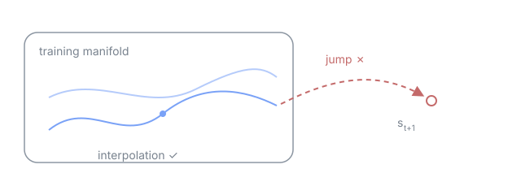

> **This is a mockup post.** It is a fake review written to check the site layout, not a real paper. Once you are done checking, delete this file pair (`.ko.md`/`.en.md`) and `assets/llms-cant-jump/`.

## Reference

| Field   | Value                             |
| ------- | --------------------------------- |
| Authors | J. Doe, A. Nonymous               |
| Venue   | ICML 2026 (fictional)             |
| Code    | [github.com/example/jump-bench](https://github.com/example/jump-bench) |

## Summary

The authors argue that LLMs are strong at interpolation inside the training distribution but collapse on **jump** tasks that require discontinuous moves across the state space. The core experimental design trains models on textualized grid-world trajectories, then asks them to predict transitions into states that lie off the training trajectories.

Next-state prediction relies on the standard attention aggregation:

$$
p_\theta(s_{t+1} \mid s_{\le t}) = \mathrm{softmax}\!\left(\frac{QK^\top}{\sqrt{d_k}}\right)V
$$

The authors show that as soon as the target state $s_{t+1}$ leaves the $\varepsilon$-neighborhood of training trajectories, accuracy drops sharply — and the drop is nearly independent of model size. They frame this as a representational limit, separate from the familiar $O(n^2)$ cost in sequence length.



## Protocol

The evaluation loop looks roughly like this:

```python
def evaluate_jump(model, world, horizon: int = 32) -> float:
    """Roll out the model and score it on out-of-manifold jumps."""
    state = world.reset()
    hits = 0
    for _ in range(horizon):
        pred = model.predict(state)
        state = world.step()
        hits += int(pred == state)
    return hits / horizon
```

Whether a step counts as interpolation or a jump is defined by how far the state returned by `world.step()` lies from the training-set trajectories. Inline code renders like `evaluate_jump(model, world)`.

## Impressions

> What is interesting is the *way* the model fails. At jump points it does not err randomly — it quietly falls back onto the nearest training trajectory.

- The task design is clean, and the benchmark and reproduction scripts are public[^1].
- The conclusion "LLMs lack a world model", however, overreaches the measurement. What the experiments show is extrapolation failure, not the absence of an internal representation.
- An ablation that explicitly mixes off-trajectory states into training would have strengthened the paper.

Related review: [Satantango](../books/satantango.en.md) — this link checks that internal links get rewritten to site URLs.

#llm #reasoning #benchmark

[^1]: A footnote for rendering checks. Neither the code URL nor the paper exists.
